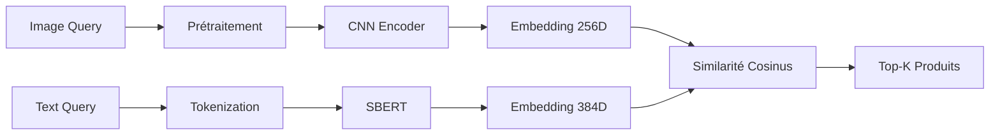

# Plateforme de Recommandation de Produits Chanel

Système de recommandation intelligent combinant analyse visuelle et textuelle pour les produits Chanel.

## Table des matières

- [Vue d'ensemble](#-vue-densemble)
- [Structure du projet](#-structure-du-projet)
- [Installation](#-installation)
- [Utilisation](#-utilisation)
- [Architecture technique](#-architecture-technique)
- [Résultats](#-résultats)

## Vue d'ensemble

Ce projet implémente un système de recommandation multimodal pour le catalogue de produits Chanel. Il combine :
- **Analyse visuelle** : CNN personnalisé et ConvNeXt pré-entraîné
- **Analyse textuelle** : Sentence-BERT pour les embeddings sémantiques
- **Apprentissage auto-supervisé** : SimCLR pour des représentations visuelles robustes

### Fonctionnalités principales

- Recherche par image (téléchargement d'une photo)  
- Recherche par texte (description en langage naturel)  
- Recherche hybride (combinaison image + texte)  
- Analyse comparative de différentes méthodes d'embeddings  
- Visualisations interactives (t-SNE, UMAP)

## Structure du projet

```
recommandations-chanel/
├── partie1.ipynb              # Analyse exploratoire du dataset
├── partie2.ipynb              # Comparaison des embeddings visuels
├── partie3.ipynb              # Analyse des embeddings textuels
├── app.py                     # Application Streamlit de démonstration
├── data.parquet               # Dataset brut (900+ produits)
├── data_cleaned.parquet       # Dataset nettoyé
├── titles_en.csv              # Traductions des titres (DE → EN)
├── checkpoints/
│   ├── data_with_images.csv   # Métadonnées + chemins d'images
│   ├── label_encoder.pkl      # Encodeur pour les catégories
│   ├── models/
│   │   ├── cnn_model.keras           # Modèle CNN entraîné
│   │   ├── convnext_model.keras      # ConvNeXt fine-tuné
│   │   └── simclr_encoder.keras      # Encodeur SimCLR
│   └── embeddings/
│       ├── cnn_embeddings.npy        # Embeddings CNN (256D)
│       ├── convnext_embeddings.npy   # Embeddings ConvNeXt (256D)
│       ├── simclr_embeddings.npy     # Embeddings SimCLR (256D)
│       └── embeddings_sbert.npy      # Embeddings SBERT (384D)
└── images_cache/              # Cache local des images produits
```

## Installation

### Prérequis

- Python 3.8+
- CUDA (optionnel, pour l'accélération GPU)

### Installation des dépendances

```bash
pip install -r requirements.txt
```

### Téléchargement des modèles pré-entraînés

Télécharger depuis Google Drive :
[Lien vers les modèles](https://drive.google.com/file/d/1RiFQEqgC67T17oxdKqo047T7G7Ks8-ET/view?usp=sharing)

Une fois téléchargés, placer le dossier décompressé à la racine du projet.

## Utilisation

### 1. Exploration et analyse (Notebooks)

#### Partie 1 : Analyse du dataset
```bash
jupyter notebook partie1.ipynb
```
- Statistiques descriptives
- Visualisation des catégories
- Analyse de la qualité des images
- Nettoyage et préparation des données

#### Partie 2 : Embeddings visuels
```bash
jupyter notebook partie2.ipynb
```
- Entraînement du CNN personnalisé
- Fine-tuning de ConvNeXt
- Apprentissage SimCLR (self-supervised)
- Comparaison des méthodes (Silhouette Score, t-SNE)

#### Partie 3 : Embeddings textuels
```bash
jupyter notebook partie3.ipynb
```
- Traduction automatique (DeepL API)
- Génération d'embeddings SBERT
- Clustering et visualisation UMAP
- Comparaison texte vs image

### 2. Application de démonstration

Lancer l'interface Streamlit :

```bash
streamlit run app.py
```

L'application propose 3 modes :
- **Recherche par image** : télécharger une photo de produit
- **Recherche par texte** : décrire un produit ("red lipstick", "black handbag"...)
- **Recherche combinée** : combiner image + description avec un slider de pondération

## Architecture technique

### Modèles d'embeddings visuels

| Modèle | Architecture | Dimension | Score Silhouette |
|--------|-------------|-----------|------------------|
| **CNN Custom** | 5 couches Conv2D + Dense | 256 | 0.15 |
| **ConvNeXt** | Pré-entraîné ImageNet + Fine-tuning | 256 | 0.22 |
| **SimCLR** | Apprentissage contrastif | 256 | 0.18 |

### Modèle d'embeddings textuels

- **Sentence-BERT** : `all-MiniLM-L6-v2` (384D)
- Score Silhouette : **0.42**
- ARI (texte vs catégories) : **0.42**

### Pipeline de recommandation



## Résultats

### Qualité des embeddings

**Texte (SBERT)** :
- Clusters sémantiques bien définis
- Haute cohérence intra-classe
- Sensible aux doublons de titres

**Image (CNN/ConvNeXt)** :
- Capture les similarités visuelles (couleurs, formes)
- Moins discriminant pour les catégories (identité visuelle Chanel homogène)
- ConvNeXt surpasse le CNN custom (+7% Silhouette)

**SimCLR (Self-supervised)** :
- Pas besoin de labels
- Performances intermédiaires
- Augmentations de données cruciales

### Visualisations

**UMAP - Embeddings textuels (SBERT)** :
- Amas compacts par gamme de produits (Rouge Allure, Sublimage...)
- Superposition due aux titres similaires

**UMAP - Embeddings visuels (CNN)** :
- Structure moins organisée (ARI = 0.16)
- Reflète l'identité visuelle Chanel plutôt que les catégories fonctionnelles

## Observations clés

1. **56% de titres dupliqués** → Le texte seul est insuffisant
2. **L'image apporte un complément essentiel** (montre les couleurs spécifiques)
3. **Approche hybride recommandée** : α=0.5 (50% image, 50% texte)

## Auteurs

- BASKAR Arnold
- KRETZ Victor
- MORIN Alban
- NARESH PRABAHARAN Vinith